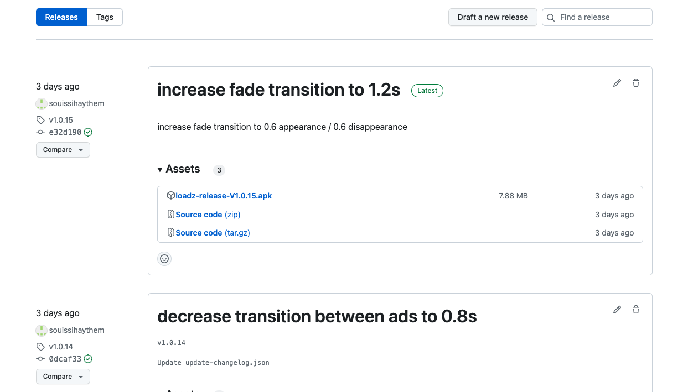
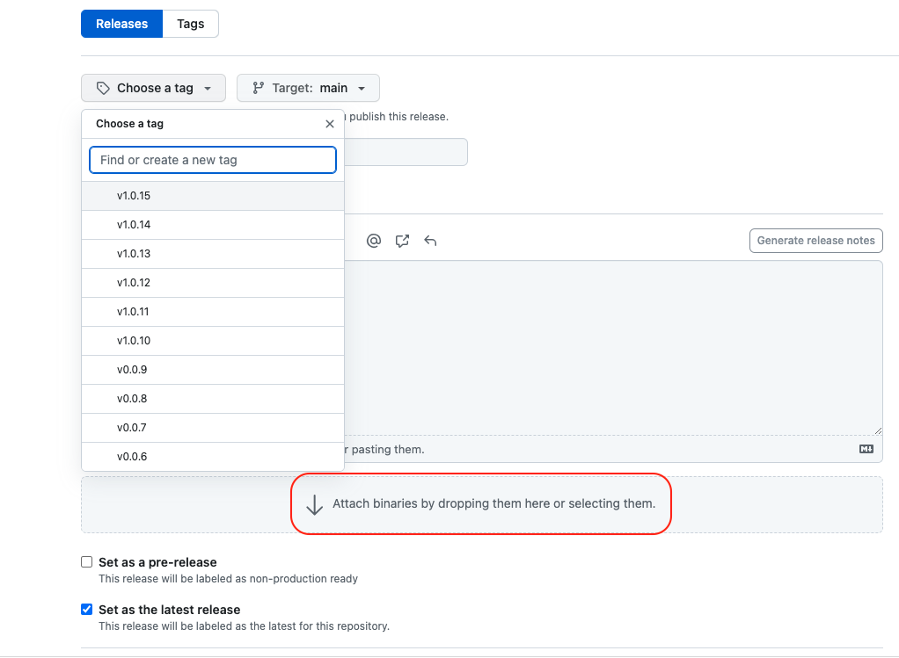

# LOADZ Apk publish instruction

## Build an apk with android studio

```
- First you need to build a release apk after you change the build name and version like this example :
  "versionCode 15"
  versionName "1.0.15"
  
- After you generate a new build that have this format like a name "loadz-release-V{versionName}.apk"
  ```

## Upload an Apk to Github 

```
- Upload tha apk generated to Github Repos :
"https://github.com/souissihaythem/loadz_totem/releases "
- You need to click in "Draft a new release" and upload the apk 


- Fill all instruction and attach your apk in this release :  


```

## Change  ChangeLog file

```
- Update the change log file with the last apk Info : 

latestVersion
latestVersionCode
FolderName  (here we have : v1.0.15)
apk name (here we have : loadz-release-V1.0.15.apk)
and save all change


```